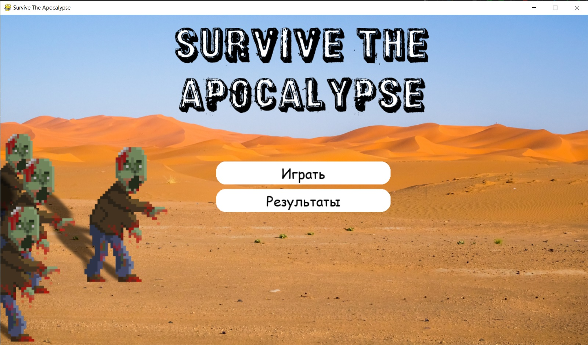

# Краткое описание программы
Данная игра представляет собой шутер с видом с верху. Повышая свой уровень ты получаешь возможность использовать улучшение оружия. С каждым уровнем тебе предстаит убивать все больше и больше врагов чтобы повысить свой уровень

# ИНСТРУКЦИЯ ПО ИСПОЛЬЗОВАНИЮ
Для того, чтобы запустить игру, необходимо открыть проект в PyCharm, установить библиотеки с помощью файла requirements.txt

pip install -r requirements.txt

После установки запустить файл game.py

Вы увидете такое окно, чтобы начать игру нажмите кнопку "Играть"

Чтобы передвигаться используйте превычные всем геймерам клавиши WASD 

Далее в появившемся окне верхний статусбар - это ваш опыт, нижний - ваше здоровье, слева от статусбаров вы видете свой уровень

Когда статусбар с опытом будет заполнен, вы увидете окно с выбором улучшения

Когда статусбар здоровья будет исчерпан, вы проиграете

Приятной игры!

